# Jarkom-Modul-1-2026-K-19
## Anggota Kelompok
| Nama | NRP |
| --- | --- |
| Ni Putu Maqueenta Wijaya | 5027251004 |
| Malikha Syafira Dewi | 5027251032 |
## Pembahasan Soal Jarkom Modul 1
 **1. Untuk mempersiapkan pembangunan The Wired, Lain yang berperan sebagai Router membuat tiga Switch/Gateway: Switch 1 menuju dua Entitas yaitu Alice dan Mika, Switch 2 menuju Chisa, sedangkan Switch 3 menuju Knights dan Eiri. Kelima Entitas tersebut dikonfigurasi sebagai Client di GNS3.**
### Penyelesaian:
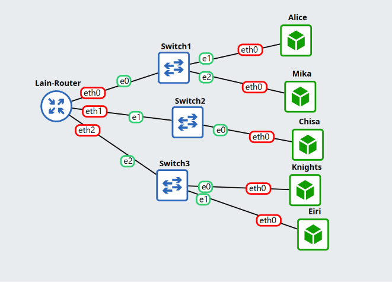<br>
Menambahkan Router (Alpinet) dengan nama `Lain`, 3 buah switch yang dihubungkan ke router Lain, dan 5 Node (Alpinet) yakni `Alice` dan `Mika` yang terhubung ke switch 1, `Chisa` yang terhubung ke switch 2, dan `Knights` dan `Eiri` yang terhubung ke switch 3.
<br>
Masing-masing node dikonfigurasikan sebagai berikut:
1. Lain
```
auto lo
iface lo inet loopback

auto eth0
iface eth0 inet dhcp

auto eth1
iface eth1 inet static
    address 10.73.1.1
    netmask 255.255.255.0

auto eth2
iface eth2 inet static
    address 10.73.2.1
    netmask 255.255.255.0

auto eth3
iface eth3 inet static
    address 10.73.3.1
    netmask 255.255.255.0

up sysctl -w net.ipv4.ip_forward=1
```

2. Alice
```
auto lo
iface lo inet loopback

auto eth0
iface eth0 inet static
    address 10.73.1.2
    netmask 255.255.255.0
    gateway 10.73.1.1
```

3. Mika
```
auto lo
iface lo inet loopback

auto eth0
iface eth0 inet static
    address 10.73.1.3
    netmask 255.255.255.0
    gateway 10.73.1.1
```

4. Chisa
```
auto lo
iface lo inet loopback

auto eth0
iface eth0 inet static
    address 10.73.2.2
    netmask 255.255.255.0
    gateway 10.73.2.1
```

5. Knights
```
auto lo
iface lo inet loopback

auto eth0
iface eth0 inet static
    address 10.73.3.2
    netmask 255.255.255.0
    gateway 10.73.3.1
```

6. Eiri
```
auto lo
iface lo inet loopback

auto eth0
iface eth0 inet static
    address 10.73.3.3
    netmask 255.255.255.0
    gateway 10.73.3.1
```

**2. Karena menurut Lain pada saat itu The Wired masih terisolasi dari dunia luar, konfigurasikan router Lain agar dapat tersambung langsung ke jaringan internet publik melalui NAT/DHCP pada interface eth0.**
### Penyelesaian:
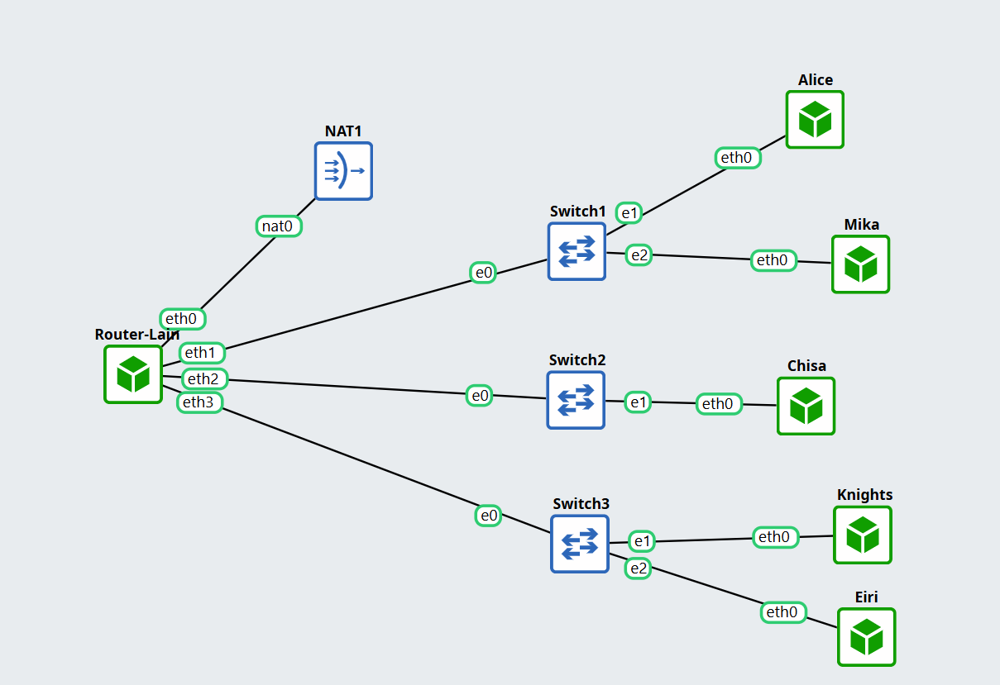<br>
Menambahkan NAT yang tersambung ke router Lain. Konfigurasi Lain diubah menjadi sebagai berikut:
```
auto lo
iface lo inet loopback

auto eth0
iface eth0 inet dhcp

auto eth1
iface eth1 inet static
    address 10.73.1.1
    netmask 255.255.255.0

auto eth2
iface eth2 inet static
    address 10.73.2.1
    netmask 255.255.255.0

auto eth3
iface eth3 inet static
    address 10.73.3.1
    netmask 255.255.255.0

up sysctl -w net.ipv4.ip_forward=1
up iptables -t nat -A POSTROUTING -o eth0 -j MASQUERADE
```
Dan pada masing-masing node seperti Alice, Mika, Chisa, Knights, dan Eiri ditambahkan konfigurasi sebagai berikut agar tidak perlu konfigurasi ulang setiap node dimatikan.
```
up echo "nameserver 1.1.1.1" > /etc/resolv.conf
up echo "nameserver 8.8.8.8" >> /etc/resolv.conf
```
**3. Setelah router Lain terhubung ke internet, pastikan seluruh Entitas (Client) di bawah Switch 1, Switch 2, dan Switch 3 dapat saling terhubung dan berkomunikasi satu sama lain melalui konfigurasi routing.**
### Penyelesaian:
Soal ini dapat dibuktikan dengan mencoba `ping` ke masing-masing node client. Contoh dari berhasil melakukan ping adalah sebagai berikut:<br>
Router Lain mencoba ping ke Node Clien Eiri<br>
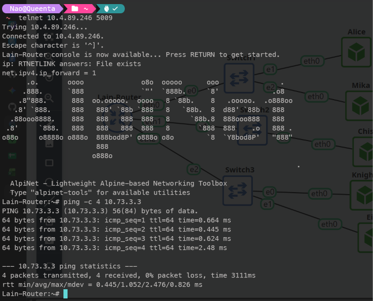<br>
Node Client Alice mencoba ping ke Node Clien Chisa<br>
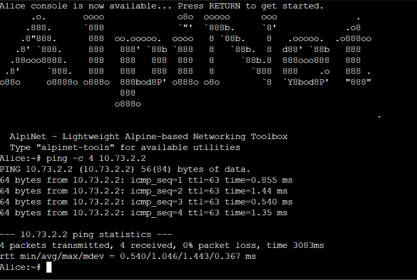<br>

**4. Lain ingin agar setiap Entitas (Client) memiliki kemandirian di The Wired. Konfigurasikan firewall/iptables (NAT Masquerade) dan DNS resolver agar setiap Client dapat terhubung ke internet secara mandiri (dapat melakukan ping ke 8.8.8.8 dan membuka domain web google.com).**
### Penyelesaian:
Nomor ini bisa diselesaikan dengan mencoba `ping` ke `google.com` dari masing-masing Node Client. Contoh dari berhasil melakukan ping ke `google.com` adalah sebagai berikut:<br>
Node Client Eiri melakukan ping ke `google.com`<br>
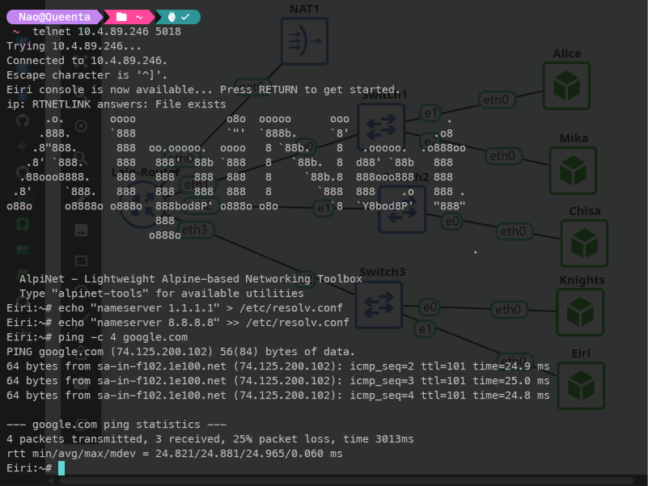

**5. Eiri tetap berupaya menanamkan kekacauan ke dalam jaringan. Untuk mengantisipasi restart tiba-tiba, pastikan seluruh konfigurasi jaringan tidak hilang saat semua node di-restart. Buat script verifikasi di /root/cek_status.sh pada router Lain yang menampilkan ringkasan interface (ip -br a) dan status tabel NAT (iptables -t nat -L -v -n) setelah reboot.**
### Penyelesaian:
Soal ini diselesaikan dengan membuka konsol Router Lain dan membuat file script `cek_status.sh` pada root sebagai berikut:<br>
```
nano /root/cek_status.sh
```
kemudian
```
#!/bin/sh
echo "=========================================="
echo "          RINGKASAN INTERFACE             "
echo "=========================================="
ip -br a

echo ""
echo "=========================================="
echo "            STATUS TABEL NAT              "
echo "=========================================="
iptables -t nat -L -v -n
```
Kemudian dijalankan dengan
```
chmod +x /root/cek_status.sh
/root/cek_status.sh
```
Hasil dari `cek_status.sh` adalah sebagai berikut:
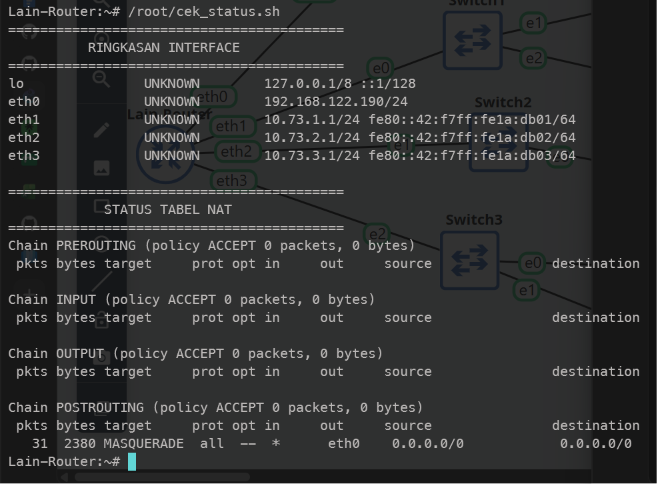<br>
**11. Buktikan kelemahan protokol Telnet dengan membuat akun phantom_user dan password wired_ghost pada layanan telnetd di node Chisa. Lakukan login Telnet dari node Eiri ke node Chisa dan tangkap sesi menggunakan Wireshark. Tunjukkan kredensial plain text melalui fitur Follow TCP Stream, serta jelaskan mengapa setiap karakter terkirim dalam paket TCP terpisah.**
### Penyelesaian:
Pertama-tama kita perlu menjalankan beberapa command pada konsol Node Client Chisa.
```bash
apk update
apk add busybos-extras
adduser -D phantom_user
echo "phantom_user:wired_ghost" | chpasswd
telnetd -F -p 23 &
```
Kemudian kita bisa memilih `Start capture` pada kabel penghubung node Eiri dan switch. Buka konsol Node Client Eiri dan hubungi IP Node Client Chisa.
```
telnet 10.73.2.2 23
whoami
```
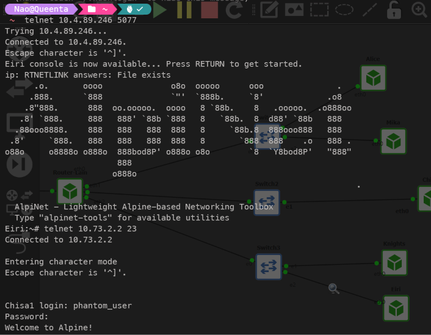<br>
<br>
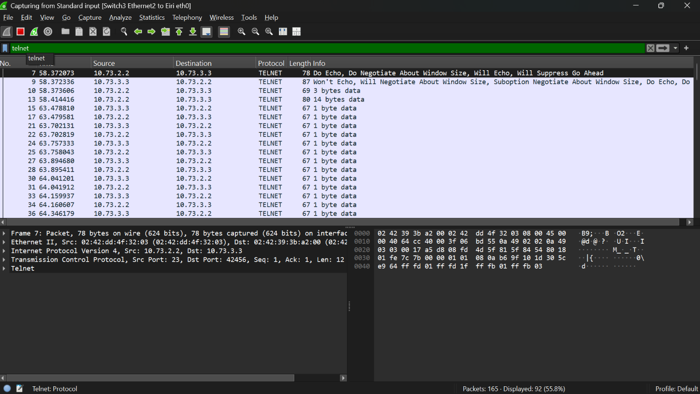<br>
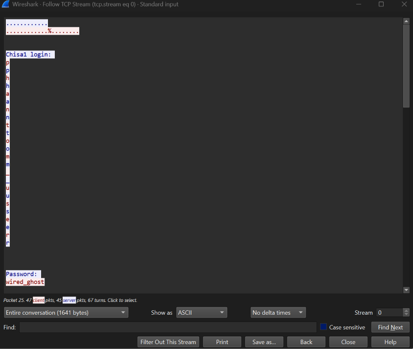
Hal ini terjadi karena protokol Telnet menggunakan mekanisme Remote Echo, di mana server mengirimkan kembali (echo) setiap karakter yang diketik pengguna agar tampil di layar terminal. Ketika Wireshark menggabungkan alur lalu lintas dua arah ke dalam TCP Stream, karakter asli yang diketik client (merah) bersanding langsung dengan karakter balasan dari server (biru) sehingga huruf terlihat ganda. Sementara pada masukan Password, server sengaja mematikan fitur echo demi keamanan, sehingga hanya data asli dari client yang terekam dan hurufnya tidak mengganda (wired_ghost).<br>
**12. Alice mencurigai Knights menjalankan beberapa layanan rahasia di node-nya. Lakukan pemindaian port dari node Alice ke node Knights menggunakan Netcat (nc) untuk memeriksa port 22 (SSH) dan 80 (HTTP) dalam keadaan terbuka, serta port rahasia 7777 dalam keadaan tertutup. Analisis di Wireshark perbedaan TCP Flag yang dikembalikan antara port terbuka (SYN-ACK) dengan port tertutup (RST-ACK).**
### Penyelesaian:
Soal ini bisa diselesaikan dengan mendownload dan menyalakan service pada Node Client Knights terlebih dahulu.
```bash
apk update
apk add openssh lighttpd busybox-extras
ssh-keygen -A
/usr/sbin/sshd
lighttpd -f /etc/lighttpd/lighttpd.conf
```
Kemudian bisa dilanjutkan dengan `Start capture` pada kabel yang menghubungkan Alice dan Switch 1. Selanjutnya bisa melakukan Netcat pada Node Client Alice
```bash
nc -zv -w 2 10.73.3.2 22
nc -zv -w 2 10.73.3.2 80
nc -zv -w 2 10.73.3.2 7777
```
Seharusnya akan muncul seperti ini
```bash
Alice:~# nc -zv -w 2 10.73.3.2 22
10.73.3.2 (10.73.3.2:22) open
Alice:~# nc -zv -w 2 10.73.3.2 80
10.73.3.2 (10.73.3.2:80) open
Alice:~# nc -zv -w 2 10.73.3.2 7777
nc: connect to 10.73.3.2 port 7777 (tcp) failed: Connection refused
```
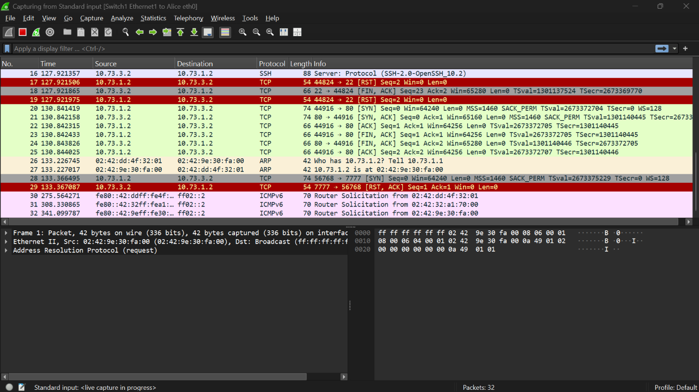<br>
Analisis:
- Port terbuka: Port 80 (HTTP). Paket No. 20 - Alice (10.73.1.2) mengirim `[SYN]` ke port 80. Paket No. 21 (Balasan) - Knights(10.73.3.2) membalas dengan `[SYN, ACK]` yang berarti port 80 terbuka dan menerima koleksi.
- Port tertutup: Port 777. Paket No. 28 - Alice (10.73.1.2) mengirim `[SYN]` ke port 777. Paket No. 29 membalas dengan `[RST, ACK]` yang berarti tertutup atau koneksi ditolak.
- Port terbuka berwarna hijau, port tertutup berwarna merah.
**13. Lain memerintahkan agar administrasi jarak jauh menggunakan SSH secara aman tanpa password. Install OpenSSH server pada node Knights, buat pasangan kunci SSH (ssh-keygen) pada node Mika untuk user mika_admin, dan konfigurasikan public key authentication (PasswordAuthentication no). Lakukan koneksi SSH dari node Mika ke node Knights, tangkap sesi menggunakan Wireshark, identifikasi paket Protocol Version Exchange dan Key Exchange, serta jelaskan mengapa kredensial tidak terlihat dalam bentuk teks terbuka seperti pada Telnet.**
### Penyelesaian:
Soal ini dapat diselesaikan dengan menjalankan beberapa command pada Node Client Knights sebagai berikut:
```bash
apk update
apk add openssh

ssh-keygen -A

adduser -D mika_admin

mkdir -p /home/mika_admin/.ssh
touch /home/mika_admin/.ssh/authorized_keys
chmod 700 /home/mika_admin
chmod 700 /home/mika_admin/.ssh
chmod 600 /home/mika_admin/.ssh/authorized_keys
chown -R mika_admin:mika_admin /home/mika_admin

sed -i '/PasswordAuthentication/d' /etc/ssh/sshd_config
sed -i '/PubkeyAuthentication/d' /etc/ssh/sshd_config
sed -i '/StrictModes/d' /etc/ssh/sshd_config
sed -i '/AuthorizedKeysFile/d' /etc/ssh/sshd_config

echo "PasswordAuthentication no" >> /etc/ssh/sshd_config
echo "PubkeyAuthentication yes" >> /etc/ssh/sshd_config
echo "StrictModes no" >> /etc/ssh/sshd_config
echo "AuthorizedKeysFile /home/mika_admin/.ssh/authorized_keys" >> /etc/ssh/sshd_config

/usr/sbin/sshd
```
Kemudian buka konsol Node Client Mika dan jalankan
```bash
apk update
apk add openssh-client

rm -rf ~/.ssh

ssh-keygen -t rsa -b 2048 -f ~/.ssh/id_rsa -N ""

cat ~/.ssh/id_rsa.pub
```
Didapatkan public key:
```
ssh-rsa AAAAB3NzaC1yc2EAAAADAQABAAABAQDSOp/qYFfiO4bap6PLqVU4Ecbx0554DEHKUgdmUVf/X8TsUDxE011KvwHjj3PPBFVqHjokGWTTyjE69bs6dP2P17nMm0ESYUqTK0S4+yNpCQXxNvwkaH8GjdSKRUnZeVLH1gVt2AESpwaV3b+LoNyaZUikkVH7Qhw0AHOePTW2q/icW3qvaz4H6ZdWffqSFHSHDCVip9W87aBCrkw/ITr2UWcT9gu3poGdPstm//goQs+Ci5OvhH9WD97QA/9DEqIw49oSjFSCjBuN/nwTku0PiY3zYakFSe0IW/kQQYH+x4y6t3N4NDxjzF8JBIgpQr/0Jks+PPX/2meax6T2cjRb root@Mika
```
Kembali lagi ke Node Client Knights dan jalankan
```bash
cat << 'EOF' > /home/mika_admin/.ssh/authorized_keys
ssh-rsa AAAAB3NzaC1yc2EAAAADAQABAAABAQDSOp/qYFfiO4bap6PLqVU4Ecbx0554DEHKUgdmUVf/X8TsUDxE011KvwHjj3PPBFVqHjokGWTTyjE69bs6dP2P17nMm0ESYUqTK0S4+yNpCQXxNvwkaH8GjdSKRUnZeVLH1gVt2AESpwaV3b+LoNyaZUikkVH7Qhw0AHOePTW2q/icW3qvaz4H6ZdWffqSFHSHDCVip9W87aBCrkw/ITr2UWcT9gu3poGdPstm//goQs+Ci5OvhH9WD97QA/9DEqIw49oSjFSCjBuN/nwTku0PiY3zYakFSe0IW/kQQYH+x4y6t3N4NDxjzF8JBIgpQr/0Jks+PPX/2meax6T2cjRb root@Mika
EOF

chmod 600 /home/mika_admin/.ssh/authorized_keys
chown -R mika_admin:mika_admin /home/mika_admin/.ssh
```
Lanjut lagi ke Node Client Mika dan jalankan
```bash
ssh -i ~/.ssh/id_rsa mika_admin@10.73.3.2
```
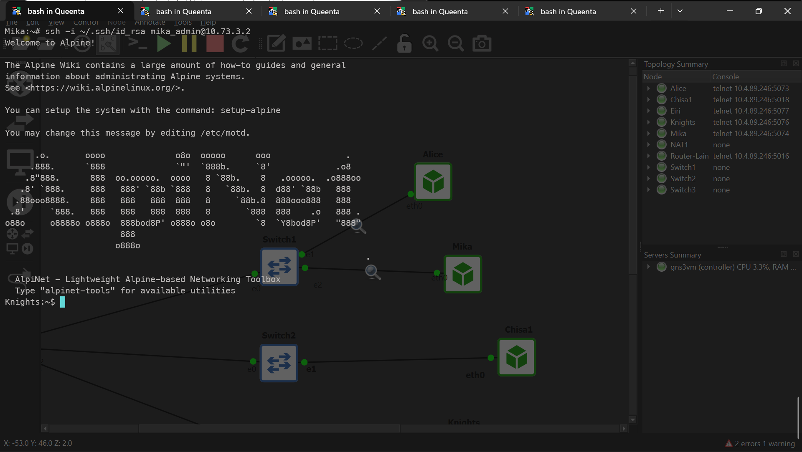<br>
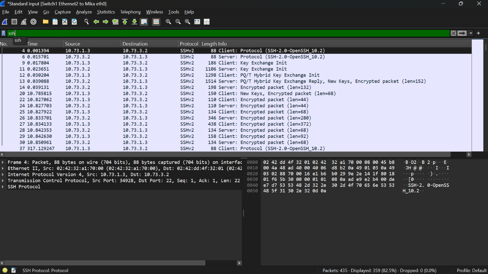<br>
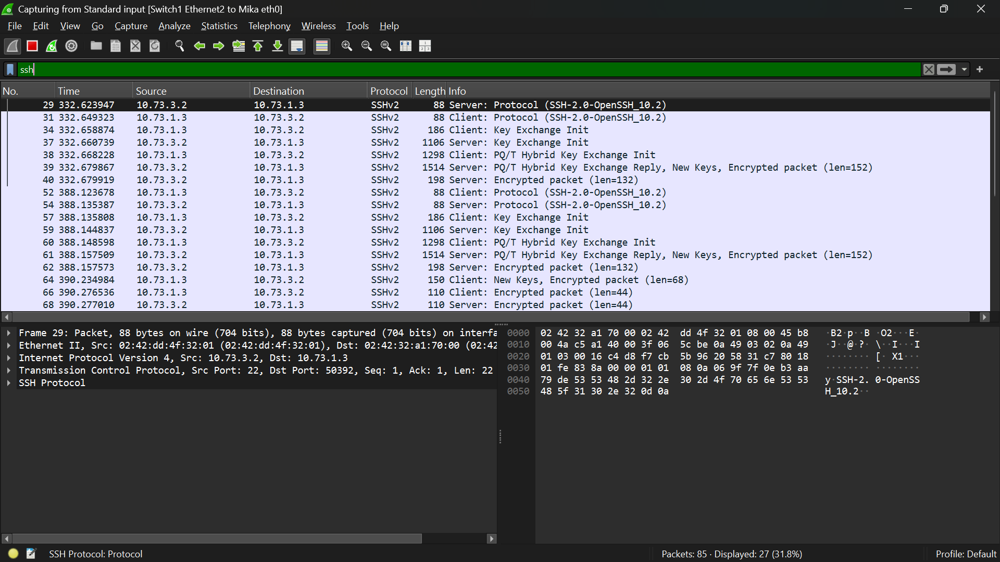<br>
### Protocol Version Exchange:
**Paket**: Terletak di bagian paling awal alur SSH.<br>
**Tampilan Kolom Info**:<br>
- **Client**: `Protocol (SSH-2.0-OpenSSH_10.2)`
- **Server**: `Protocol (SSH-2.0-OpenSSH_10.2)`
<br> **Fungsi**: Kedua node (Mika dan Knights) saling menyapa dan memverifikasi bahwa keduanya menggunakan versi protokol yang sama (SSHv2).
### Key Exchange (KEX):
**Paket**: Berada tepat setelah Protocol Version Exchange.<br>
**Tampilan Kolom Info**:<br>
- `SSH2_MSG_KEXINIT`
- `SSH2_MSG_KEX_ECDH_INIT / SSH2_MSG_KEX_ECDH_REPLY`
<br> **Fungsi**: Mika dan Knights menyepakati algoritma enkripsi (seperti AES atau ChaCha20-Poly1305) serta melakukan pertukaran kunci simetris (shared secret key) secara aman menggunakan metode Diffie-Hellman tanpa mengirimkan kunci asli melewati jaringan.