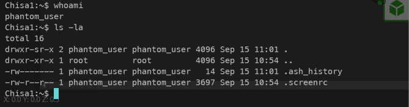

# Jarkom-Modul-1-2026-K-19
## Anggota Kelompok
| Nama | NRP |
| --- | --- |
| Ni Putu Maqueenta Wijaya | 5027251004 |
| Malikha Syafira Dewi | 5027251032 |
## Pembahasan Soal Jarkom Modul 1
 **1. Untuk mempersiapkan pembangunan The Wired, Lain yang berperan sebagai Router membuat tiga Switch/Gateway: Switch 1 menuju dua Entitas yaitu Alice dan Mika, Switch 2 menuju Chisa, sedangkan Switch 3 menuju Knights dan Eiri. Kelima Entitas tersebut dikonfigurasi sebagai Client di GNS3.**
### Penyelesaian:
<br>
Menambahkan Router (Alpinet) dengan nama `Lain`, 3 buah switch yang dihubungkan ke router Lain, dan 5 Node (Alpinet) yakni `Alice` dan `Mika` yang terhubung ke switch 1, `Chisa` yang terhubung ke switch 2, dan `Knights` dan `Eiri` yang terhubung ke switch 3.
<br>
Masing-masing node dikonfigurasikan sebagai berikut:
1. Lain
```
auto lo
iface lo inet loopback

auto eth0
iface eth0 inet dhcp

auto eth1
iface eth1 inet static
    address 10.73.1.1
    netmask 255.255.255.0

auto eth2
iface eth2 inet static
    address 10.73.2.1
    netmask 255.255.255.0

auto eth3
iface eth3 inet static
    address 10.73.3.1
    netmask 255.255.255.0

up sysctl -w net.ipv4.ip_forward=1
```

2. Alice
```
auto lo
iface lo inet loopback

auto eth0
iface eth0 inet static
    address 10.73.1.2
    netmask 255.255.255.0
    gateway 10.73.1.1
```

3. Mika
```
auto lo
iface lo inet loopback

auto eth0
iface eth0 inet static
    address 10.73.1.3
    netmask 255.255.255.0
    gateway 10.73.1.1
```

4. Chisa
```
auto lo
iface lo inet loopback

auto eth0
iface eth0 inet static
    address 10.73.2.2
    netmask 255.255.255.0
    gateway 10.73.2.1
```

5. Knights
```
auto lo
iface lo inet loopback

auto eth0
iface eth0 inet static
    address 10.73.3.2
    netmask 255.255.255.0
    gateway 10.73.3.1
```

6. Eiri
```
auto lo
iface lo inet loopback

auto eth0
iface eth0 inet static
    address 10.73.3.3
    netmask 255.255.255.0
    gateway 10.73.3.1
```

**2. Karena menurut Lain pada saat itu The Wired masih terisolasi dari dunia luar, konfigurasikan router Lain agar dapat tersambung langsung ke jaringan internet publik melalui NAT/DHCP pada interface eth0.**
### Penyelesaian:
<br>
Menambahkan NAT yang tersambung ke router Lain. Konfigurasi Lain diubah menjadi sebagai berikut:
```
auto lo
iface lo inet loopback

auto eth0
iface eth0 inet dhcp

auto eth1
iface eth1 inet static
    address 10.73.1.1
    netmask 255.255.255.0

auto eth2
iface eth2 inet static
    address 10.73.2.1
    netmask 255.255.255.0

auto eth3
iface eth3 inet static
    address 10.73.3.1
    netmask 255.255.255.0

up sysctl -w net.ipv4.ip_forward=1
up iptables -t nat -A POSTROUTING -o eth0 -j MASQUERADE
```
Dan pada masing-masing node seperti Alice, Mika, Chisa, Knights, dan Eiri ditambahkan konfigurasi sebagai berikut agar tidak perlu konfigurasi ulang setiap node dimatikan.
```
up echo "nameserver 1.1.1.1" > /etc/resolv.conf
up echo "nameserver 8.8.8.8" >> /etc/resolv.conf
```
**3. Setelah router Lain terhubung ke internet, pastikan seluruh Entitas (Client) di bawah Switch 1, Switch 2, dan Switch 3 dapat saling terhubung dan berkomunikasi satu sama lain melalui konfigurasi routing.**
### Penyelesaian:
Soal ini dapat dibuktikan dengan mencoba `ping` ke masing-masing node client. Contoh dari berhasil melakukan ping adalah sebagai berikut:<br>
Router Lain mencoba ping ke Node Clien Eiri<br>
<br>
Node Client Alice mencoba ping ke Node Clien Chisa<br>
<br>

**4. Lain ingin agar setiap Entitas (Client) memiliki kemandirian di The Wired. Konfigurasikan firewall/iptables (NAT Masquerade) dan DNS resolver agar setiap Client dapat terhubung ke internet secara mandiri (dapat melakukan ping ke 8.8.8.8 dan membuka domain web google.com).**
### Penyelesaian:
Nomor ini bisa diselesaikan dengan mencoba `ping` ke `google.com` dari masing-masing Node Client. Contoh dari berhasil melakukan ping ke `google.com` adalah sebagai berikut:<br>
Node Client Eiri melakukan ping ke `google.com`<br>


**5. Eiri tetap berupaya menanamkan kekacauan ke dalam jaringan. Untuk mengantisipasi restart tiba-tiba, pastikan seluruh konfigurasi jaringan tidak hilang saat semua node di-restart. Buat script verifikasi di /root/cek_status.sh pada router Lain yang menampilkan ringkasan interface (ip -br a) dan status tabel NAT (iptables -t nat -L -v -n) setelah reboot.**
### Penyelesaian:
Soal ini diselesaikan dengan membuka konsol Router Lain dan membuat file script `cek_status.sh` pada root sebagai berikut:<br>
```
nano /root/cek_status.sh
```
kemudian
```
#!/bin/sh
echo "=========================================="
echo "          RINGKASAN INTERFACE             "
echo "=========================================="
ip -br a

echo ""
echo "=========================================="
echo "            STATUS TABEL NAT              "
echo "=========================================="
iptables -t nat -L -v -n
```
Kemudian dijalankan dengan
```
chmod +x /root/cek_status.sh
/root/cek_status.sh
```
Hasil dari `cek_status.sh` adalah sebagai berikut:
<br>
**11. Buktikan kelemahan protokol Telnet dengan membuat akun phantom_user dan password wired_ghost pada layanan telnetd di node Chisa. Lakukan login Telnet dari node Eiri ke node Chisa dan tangkap sesi menggunakan Wireshark. Tunjukkan kredensial plain text melalui fitur Follow TCP Stream, serta jelaskan mengapa setiap karakter terkirim dalam paket TCP terpisah.**
### Penyelesaian:
Pertama-tama kita perlu menjalankan beberapa command pada konsol Node Client Chisa.
```bash
apk update
apk add busybos-extras
adduser -D phantom_user
echo "phantom_user:wired_ghost" | chpasswd
telnetd -F -p 23 &
```
Kemudian kita bisa memilih `Start capture` pada kabel penghubung node Eiri dan switch. Buka konsol Node Client Eiri dan hubungi IP Node Client Chisa.
```
telnet 10.73.2.2 23
whoami
```
<br>
<br>