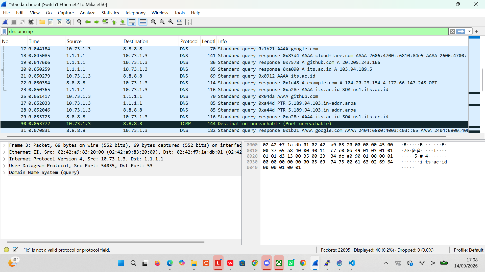

# Jarkom-Modul-1-2026-K-19
## Anggota Kelompok
| Nama | NRP |
| --- | --- |
| Ni Putu Maqueenta Wijaya | 5027251004 |
| Malikha Syafira Dewi | 5027251032 |
## Pembahasan Soal Jarkom Modul 1
 **1. Untuk mempersiapkan pembangunan The Wired, Lain yang berperan sebagai Router membuat tiga Switch/Gateway: Switch 1 menuju dua Entitas yaitu Alice dan Mika, Switch 2 menuju Chisa, sedangkan Switch 3 menuju Knights dan Eiri. Kelima Entitas tersebut dikonfigurasi sebagai Client di GNS3.**
### Penyelesaian:
<br>
Menambahkan Router (Alpinet) dengan nama `Lain`, 3 buah switch yang dihubungkan ke router Lain, dan 5 Node (Alpinet) yakni `Alice` dan `Mika` yang terhubung ke switch 1, `Chisa` yang terhubung ke switch 2, dan `Knights` dan `Eiri` yang terhubung ke switch 3.
<br>
Masing-masing node dikonfigurasikan sebagai berikut:
1. Lain
```
auto lo
iface lo inet loopback

auto eth0
iface eth0 inet dhcp

auto eth1
iface eth1 inet static
    address 10.73.1.1
    netmask 255.255.255.0

auto eth2
iface eth2 inet static
    address 10.73.2.1
    netmask 255.255.255.0

auto eth3
iface eth3 inet static
    address 10.73.3.1
    netmask 255.255.255.0

up sysctl -w net.ipv4.ip_forward=1
```

2. Alice
```
auto lo
iface lo inet loopback

auto eth0
iface eth0 inet static
    address 10.73.1.2
    netmask 255.255.255.0
    gateway 10.73.1.1
```

3. Mika
```
auto lo
iface lo inet loopback

auto eth0
iface eth0 inet static
    address 10.73.1.3
    netmask 255.255.255.0
    gateway 10.73.1.1
```

4. Chisa
```
auto lo
iface lo inet loopback

auto eth0
iface eth0 inet static
    address 10.73.2.2
    netmask 255.255.255.0
    gateway 10.73.2.1
```

5. Knights
```
auto lo
iface lo inet loopback

auto eth0
iface eth0 inet static
    address 10.73.3.2
    netmask 255.255.255.0
    gateway 10.73.3.1
```

6. Eiri
```
auto lo
iface lo inet loopback

auto eth0
iface eth0 inet static
    address 10.73.3.3
    netmask 255.255.255.0
    gateway 10.73.3.1
```

**2. Karena menurut Lain pada saat itu The Wired masih terisolasi dari dunia luar, konfigurasikan router Lain agar dapat tersambung langsung ke jaringan internet publik melalui NAT/DHCP pada interface eth0.**
### Penyelesaian:
<br>
Menambahkan NAT yang tersambung ke router Lain. Konfigurasi Lain diubah menjadi sebagai berikut:
```
auto lo
iface lo inet loopback

auto eth0
iface eth0 inet dhcp

auto eth1
iface eth1 inet static
    address 10.73.1.1
    netmask 255.255.255.0

auto eth2
iface eth2 inet static
    address 10.73.2.1
    netmask 255.255.255.0

auto eth3
iface eth3 inet static
    address 10.73.3.1
    netmask 255.255.255.0

up sysctl -w net.ipv4.ip_forward=1
up iptables -t nat -A POSTROUTING -o eth0 -j MASQUERADE
```
Dan pada masing-masing node seperti Alice, Mika, Chisa, Knights, dan Eiri ditambahkan konfigurasi sebagai berikut agar tidak perlu konfigurasi ulang setiap node dimatikan.
```
up echo "nameserver 1.1.1.1" > /etc/resolv.conf
up echo "nameserver 8.8.8.8" >> /etc/resolv.conf
```
**3. Setelah router Lain terhubung ke internet, pastikan seluruh Entitas (Client) di bawah Switch 1, Switch 2, dan Switch 3 dapat saling terhubung dan berkomunikasi satu sama lain melalui konfigurasi routing.**
### Penyelesaian:
Soal ini dapat dibuktikan dengan mencoba `ping` ke masing-masing node client. Contoh dari berhasil melakukan ping adalah sebagai berikut:<br>
Router Lain mencoba ping ke Node Clien Eiri<br>
<br>
Node Client Alice mencoba ping ke Node Clien Chisa<br>
<br>

**4. Lain ingin agar setiap Entitas (Client) memiliki kemandirian di The Wired. Konfigurasikan firewall/iptables (NAT Masquerade) dan DNS resolver agar setiap Client dapat terhubung ke internet secara mandiri (dapat melakukan ping ke 8.8.8.8 dan membuka domain web google.com).**
### Penyelesaian:
Nomor ini bisa diselesaikan dengan mencoba `ping` ke `google.com` dari masing-masing Node Client. Contoh dari berhasil melakukan ping ke `google.com` adalah sebagai berikut:<br>
Node Client Eiri melakukan ping ke `google.com`<br>


**5. Eiri tetap berupaya menanamkan kekacauan ke dalam jaringan. Untuk mengantisipasi restart tiba-tiba, pastikan seluruh konfigurasi jaringan tidak hilang saat semua node di-restart. Buat script verifikasi di /root/cek_status.sh pada router Lain yang menampilkan ringkasan interface (ip -br a) dan status tabel NAT (iptables -t nat -L -v -n) setelah reboot.**
### Penyelesaian:
Soal ini diselesaikan dengan membuka konsol Router Lain dan membuat file script `cek_status.sh` pada root sebagai berikut:<br>
```
nano /root/cek_status.sh
```
kemudian
```
#!/bin/sh
echo "=========================================="
echo "          RINGKASAN INTERFACE             "
echo "=========================================="
ip -br a

echo ""
echo "=========================================="
echo "            STATUS TABEL NAT              "
echo "=========================================="
iptables -t nat -L -v -n
```
Kemudian dijalankan dengan
```
chmod +x /root/cek_status.sh
/root/cek_status.sh
```
Hasil dari `cek_status.sh` adalah sebagai berikut:
<br>
**6. Mika mencurigai adanya anomali traffic pada segmen jaringannya. Jalankan generator traffic pada node Mika, lalu lakukan packet sniffing menggunakan Wireshark pada interface node Mika. Terapkan display filter khusus untuk menyaring paket yang berprotokol DNS atau ICMP. Tunjukkan screenshot hasil filter beserta ringkasan paket yang lolos.**
### Penyeleseian :
Membuka console nose Mika, lalu buat script:
```
nano traffic_protocol7.sh
```
kemudian
```
# ============================================
# Traffic Generator — Protocol 7 Network
# Serial Experiments Lain — Modul 1 Jarkom 2026
# Jalankan di node MIKA untuk generate traffic DNS & ICMP
# ============================================

echo "============================================"
echo "  Protocol 7 Traffic Generator v2026"
echo "  Node: Mika Iwakura"
echo "============================================"
echo "[*] Generating DNS & ICMP traffic..."

# ICMP Traffic
ping -c 5 8.8.8.8 &
ping -c 5 1.1.1.1 &
ping -c 3 its.ac.id &

# DNS Queries
nslookup google.com 8.8.8.8 &
nslookup its.ac.id 8.8.8.8 &
nslookup github.com 1.1.1.1 &
dig @8.8.8.8 example.com A &
dig @1.1.1.1 cloudflare.com AAAA &

wait
echo "[*] Traffic generation complete."
echo "[*] Check Wireshark for captured packets."
```
menjalankan script dibawah ini sambil melakukan Start Capture di wireshark pada jalur mika 
```
chmod +x traffic_protocol7.sh
./traffic_protocol7.sh
```
Hasil Wireshark
Filter `dns or icmm`

Analisis Protocol Hierarchy
_6.png)
Trafik yang tersaring didominasi oleh DNS (90%) hasil dari perintah nslookup dan dig ke berbagai domain (google.com, github.com, its.ac.id, cloudflare.com), dan ICMP (10%) hasil dari perintah ping ke 8.8.8.8 dan 1.1.1.1. Filter gabungan "dns or icmp" berhasil menyaring 40 dari total 22.895 paket yang ter-capture.
**7. Membangun FTP Server di node `Chisa` dengan direktori `/var/wired/data` dan menerapkan kontrol akses berbasis user.**
### Penyelesaian:
Membuka console di node chisa, setelah itu install `vsftpd` dan membuat direktori shared;
```
apk update && apk add vsftpd inetutils-ftp
mkdir -p /var/wired/data
```
selanjutnya membuat akun `alice`, `mika` dan `eiri`:
```
adduser -D alice
passwd alice

adduser -D mika
passwd mika

adduser -D eiri
passwd eiri
```
membuat kepemilikan direktori shared 
``` 
chown -R alice:alice /var/wired/data
chmod 777 /var/wired/data
```
Membuat file konfigurasi `/etc/vsftpd/vsftpd.conf` menggunakan `cat << 'EOF'`
```bash
cat << 'EOF' > /etc/vsftpd/vsftpd.conf
anonymous_enable=NO
local_enable=YES
write_enable=YES
local_umask=022
dirmessage_enable=YES
xferlog_enable=YES
connect_from_port_20=YES
chroot_local_user=YES
allow_writeable_chroot=YES
local_root=/var/wired/data
userlist_enable=YES
userlist_file=/etc/vsftpd/userlist
userlist_deny=NO
user_config_dir=/etc/vsftpd/user_conf
EOF
```
Membuat file `etc/vsftpd/userlist` untuk whitelist user `alice` dan `mika` 
```
cat << 'EOF' > /etc/vsftpd/userlist
alice
mika
EOF
```
Mengatur hak askes read-only untuk user `mika` via `/etc/vsftpd/user_conf/mika`
```
mkdir -p /etc/vsftpd/user_conf
cat << 'EOF' > /etc/vsftpd/user_conf/mika
write_enable=NO
EOF
```
Menjalankan service FTP 
``` 
vstpd /etc/vstpd/vsftpd.conf &
```
Menguji Hak akses menggunakan 
``` 
ftp 10.73.2.2
```
Login alice 
_7.png)
Login mika 
_7.png)
Login eiri
_7.png)
**8. Mengirim dokumen intelijen dari node `Knights` ke FTP Server `Chisa` menggunakan akun `alice`.
di node Knights, buat file dokumen 
### Penyelesaian:
```
nano knights_report.txt
```
masukkan isi dari knights_report.txt
```
==================================================
  KNIGHTS OF THE EASTERN CALCULUS — STATUS REPORT
  Protocol 7 Surveillance Network
  Classification: LEVEL 7 — EYES ONLY
==================================================

Date: [CLASSIFIED]
Agent: Knights Unit Alpha
Node: Switch 3 — Subnet 10.<PREFIX>.3.0/24

---

SUBJECT: Network Reconnaissance Report

The Wired has been successfully infiltrated through
Protocol 7 channels. Current observations:

1. Router "Lain" has been identified as the central
   gateway node connecting all three subnet segments.

2. Switch 1 (10.<PREFIX>.1.0/24) hosts Alice and Mika.
   Both nodes show standard traffic patterns.

3. Switch 2 (10.<PREFIX>.2.0/24) hosts Chisa alone.
   Isolated subnet — minimal cross-traffic observed.

4. Switch 3 (10.<PREFIX>.3.0/24) — our operational base.
   Knights and Eiri coexist on this segment.

RECOMMENDATION:
Continue monitoring FTP and Telnet sessions for
plaintext credential exposure. SSH tunnels remain
impenetrable without keylog access.

--- END OF REPORT ---
Knights of the Eastern Calculus
"Let's all love Lain."
```
Jalankan capture wireshark pada link `Knights`
Hubungkan ke FTP server Chisa dan ulpad file 
```
ftp 10.73.2.2
# Login: alice / Pass: password
passive
put knights_report.txt
bye
```
Menghentikan capture dan menerapkan filer ftp pada Wireshark untuk dianlasis 
Perintah FTP untuk upload (STOR):
_8.png)
kode status sukses server (226):
_8.png)
port data TCP yang dinegosiasikan pada mode PASV:
_8.png)
Respon Server PASV: `227 Entering Passive Mode (10,73,2,2,119,238)`[cite: 1]
Analisis & Perhitungan Port Data: Dua angka terakhir pada respon PASV merupakan pasangan oktet *High Byte* ($p1$) dan *Low Byte* ($p2$)[cite: 1]. Angka **256** digunakan sebagai faktor pengali karena merupakan batas kapasitas 1 byte ($2^8 = 256$) untuk menggeser posisi *High Byte* ke dalam format port 16-bit sesuai standar RFC 959.
 $$\text{Port Data TCP} = (119 \times 256) + 238 = 30464 + 238 = 30702$$
Sehingga, transfer data FTP dilakukan melalui port TCP **30702**.
**9. Download Protokol 7 & Pembatasan Read-Only User Mika**
Mengunduh dokumen dari node Mika dan membuktikan pembatasan read-only.
### Penyelesaian: 
Di Node `Chisa` menyiapkan file `protocol7_manifesto.txt`
```
nano protocol7_manifesto.txt
```
Isi dari file `protocol7_manifesto.txt`
```
==================================================
  PROTOCOL 7 — THE MANIFESTO
  A Declaration of Digital Consciousness
  Serial Experiments Lain — Year 2026
==================================================

ARTICLE I: THE NATURE OF THE WIRED
-----------------------------------
The Wired is not merely a network of interconnected
machines. It is the collective unconscious of
humanity, rendered in packets and protocols.

Every TCP handshake is a conversation.
Every DNS query is a question.
Every encrypted tunnel is a whispered secret.

ARTICLE II: THE SEVEN PRINCIPLES
----------------------------------
1. All nodes are equal in the eyes of the router.
2. No packet shall be dropped without cause.
3. Encryption is the right of every connection.
4. Plaintext protocols expose the vulnerable.
5. The firewall protects, but also imprisons.
6. NAT masquerade hides truth behind a single face.
7. The Wired remembers everything — packet loss
   is merely a temporary forgetting.

ARTICLE III: THE PROPHECY OF LAIN
-----------------------------------
"If you're not remembered, then you never existed."

In the world of networking, persistence is survival.
A configuration that vanishes upon restart is a
thought that was never truly committed to memory.

Therefore: Save your iptables. Write your interfaces.
Let your routing tables endure beyond the power cycle.

ARTICLE IV: CONCERNING SECURITY
---------------------------------
Telnet is the glass house of protocols — transparent
to any observer with a packet sniffer.

SSH is the steel vault — its contents visible only
to those who possess the key.

Choose wisely which door you open to The Wired.

---
"No matter where you go, everyone's connected."
— Lain Iwakura
```
Dari node mika, login FTP menggunakan akun mika:
```
ftp 10.73.2.2
# Login: mika / Pass: password
passive
get protocol7_manifesto.txt
put test_mika.txt
bye
```
Hasil dari respon wireshark:
_9.png)</br>
_9.png)
Proses Download:*cSaat menjalankan perintah download `get protocol7_manifesto.txt` (terdeteksi sebagai perintah FTP `RETR protocol7_manifesto.txt`), server memberikan respon `226 Transfer complete` dengan total file 3479 bytes berhasil diterima[cite: 1].
Proses Upload (Percobaan): Saat mencoba mengunggah file `put test_mika.txt` (terdeteksi sebagai perintah FTP `STOR test_mika.txt`), server menolak aksi tersebut dengan respon `550 Permission denied.`[cite: 1]. Hal ini membuktikan bahwa kebijakan hak akses untuk user `mika` pada FTP Server Chisa berhasil dikonfigurasi secara *read-only*[cite: 1]. <br>
**10. Uji Ketahanan ICMP Ping Knights ke Chisa**
Mengirimkan paket ICMP Ping kustom dari node Knights ke server Chisa untuk mengukur performa latensi.
### Penyelesaian: 
Memulai packet capture di Wireshark pada link Knights-Switch 3, selanjutnya membuka console Knights dan jalankan perintah:
```
ping -c 77 -s 128 -i 0.3 10.73.2.2
```
Pada wireshark menerapkan filter icmp dan memeriksa detail Type/Code 
_10.png)</br>
_10.png)
Pada hasil diatas menunjukan ICMP Request (Knights -> Chisa): Type = 8 dan Code = 0, sedangkan ICMP Reply (Chisa -> Knights): Type = 0 dan Code = 0 untuk Packetloss nya 0% dari (77 dari 77 paket berhasildibalas) <br>
**11. Buktikan kelemahan protokol Telnet dengan membuat akun phantom_user dan password wired_ghost pada layanan telnetd di node Chisa. Lakukan login Telnet dari node Eiri ke node Chisa dan tangkap sesi menggunakan Wireshark. Tunjukkan kredensial plain text melalui fitur Follow TCP Stream, serta jelaskan mengapa setiap karakter terkirim dalam paket TCP terpisah.**
### Penyelesaian:
Pertama-tama kita perlu menjalankan beberapa command pada konsol Node Client Chisa.
```bash
apk update
apk add busybos-extras
adduser -D phantom_user
echo "phantom_user:wired_ghost" | chpasswd
telnetd -F -p 23 &
```
Kemudian kita bisa memilih `Start capture` pada kabel penghubung node Eiri dan switch. Buka konsol Node Client Eiri dan hubungi IP Node Client Chisa.
```
telnet 10.73.2.2 23
whoami
```
<br>
<br>
<br>

Hal ini terjadi karena protokol Telnet menggunakan mekanisme Remote Echo, di mana server mengirimkan kembali (echo) setiap karakter yang diketik pengguna agar tampil di layar terminal. Ketika Wireshark menggabungkan alur lalu lintas dua arah ke dalam TCP Stream, karakter asli yang diketik client (merah) bersanding langsung dengan karakter balasan dari server (biru) sehingga huruf terlihat ganda. Sementara pada masukan Password, server sengaja mematikan fitur echo demi keamanan, sehingga hanya data asli dari client yang terekam dan hurufnya tidak mengganda (wired_ghost).<br>
**12. Alice mencurigai Knights menjalankan beberapa layanan rahasia di node-nya. Lakukan pemindaian port dari node Alice ke node Knights menggunakan Netcat (nc) untuk memeriksa port 22 (SSH) dan 80 (HTTP) dalam keadaan terbuka, serta port rahasia 7777 dalam keadaan tertutup. Analisis di Wireshark perbedaan TCP Flag yang dikembalikan antara port terbuka (SYN-ACK) dengan port tertutup (RST-ACK).**
### Penyelesaian:
Soal ini bisa diselesaikan dengan mendownload dan menyalakan service pada Node Client Knights terlebih dahulu.
```bash
apk update
apk add openssh lighttpd busybox-extras
ssh-keygen -A
/usr/sbin/sshd
lighttpd -f /etc/lighttpd/lighttpd.conf
```
Kemudian bisa dilanjutkan dengan `Start capture` pada kabel yang menghubungkan Alice dan Switch 1. Selanjutnya bisa melakukan Netcat pada Node Client Alice
```bash
nc -zv -w 2 10.73.3.2 22
nc -zv -w 2 10.73.3.2 80
nc -zv -w 2 10.73.3.2 7777
```
Seharusnya akan muncul seperti ini
```bash
Alice:~# nc -zv -w 2 10.73.3.2 22
10.73.3.2 (10.73.3.2:22) open
Alice:~# nc -zv -w 2 10.73.3.2 80
10.73.3.2 (10.73.3.2:80) open
Alice:~# nc -zv -w 2 10.73.3.2 7777
nc: connect to 10.73.3.2 port 7777 (tcp) failed: Connection refused
```
<br>
Analisis:
- Port terbuka: Port 80 (HTTP). Paket No. 20 - Alice (10.73.1.2) mengirim `[SYN]` ke port 80. Paket No. 21 (Balasan) - Knights(10.73.3.2) membalas dengan `[SYN, ACK]` yang berarti port 80 terbuka dan menerima koleksi.
- Port tertutup: Port 777. Paket No. 28 - Alice (10.73.1.2) mengirim `[SYN]` ke port 777. Paket No. 29 membalas dengan `[RST, ACK]` yang berarti tertutup atau koneksi ditolak.
- Port terbuka berwarna hijau, port tertutup berwarna merah.
**13. Lain memerintahkan agar administrasi jarak jauh menggunakan SSH secara aman tanpa password. Install OpenSSH server pada node Knights, buat pasangan kunci SSH (ssh-keygen) pada node Mika untuk user mika_admin, dan konfigurasikan public key authentication (PasswordAuthentication no). Lakukan koneksi SSH dari node Mika ke node Knights, tangkap sesi menggunakan Wireshark, identifikasi paket Protocol Version Exchange dan Key Exchange, serta jelaskan mengapa kredensial tidak terlihat dalam bentuk teks terbuka seperti pada Telnet.**
### Penyelesaian:
Soal ini dapat diselesaikan dengan menjalankan beberapa command pada Node Client Knights sebagai berikut:
```bash
apk update
apk add openssh

ssh-keygen -A

adduser -D mika_admin

mkdir -p /home/mika_admin/.ssh
touch /home/mika_admin/.ssh/authorized_keys
chmod 700 /home/mika_admin
chmod 700 /home/mika_admin/.ssh
chmod 600 /home/mika_admin/.ssh/authorized_keys
chown -R mika_admin:mika_admin /home/mika_admin

sed -i '/PasswordAuthentication/d' /etc/ssh/sshd_config
sed -i '/PubkeyAuthentication/d' /etc/ssh/sshd_config
sed -i '/StrictModes/d' /etc/ssh/sshd_config
sed -i '/AuthorizedKeysFile/d' /etc/ssh/sshd_config

echo "PasswordAuthentication no" >> /etc/ssh/sshd_config
echo "PubkeyAuthentication yes" >> /etc/ssh/sshd_config
echo "StrictModes no" >> /etc/ssh/sshd_config
echo "AuthorizedKeysFile /home/mika_admin/.ssh/authorized_keys" >> /etc/ssh/sshd_config

/usr/sbin/sshd
```
Kemudian buka konsol Node Client Mika dan jalankan
```bash
apk update
apk add openssh-client

rm -rf ~/.ssh

ssh-keygen -t rsa -b 2048 -f ~/.ssh/id_rsa -N ""

cat ~/.ssh/id_rsa.pub
```
Didapatkan public key:
```
ssh-rsa AAAAB3NzaC1yc2EAAAADAQABAAABAQDSOp/qYFfiO4bap6PLqVU4Ecbx0554DEHKUgdmUVf/X8TsUDxE011KvwHjj3PPBFVqHjokGWTTyjE69bs6dP2P17nMm0ESYUqTK0S4+yNpCQXxNvwkaH8GjdSKRUnZeVLH1gVt2AESpwaV3b+LoNyaZUikkVH7Qhw0AHOePTW2q/icW3qvaz4H6ZdWffqSFHSHDCVip9W87aBCrkw/ITr2UWcT9gu3poGdPstm//goQs+Ci5OvhH9WD97QA/9DEqIw49oSjFSCjBuN/nwTku0PiY3zYakFSe0IW/kQQYH+x4y6t3N4NDxjzF8JBIgpQr/0Jks+PPX/2meax6T2cjRb root@Mika
```
Kembali lagi ke Node Client Knights dan jalankan
```bash
cat << 'EOF' > /home/mika_admin/.ssh/authorized_keys
ssh-rsa AAAAB3NzaC1yc2EAAAADAQABAAABAQDSOp/qYFfiO4bap6PLqVU4Ecbx0554DEHKUgdmUVf/X8TsUDxE011KvwHjj3PPBFVqHjokGWTTyjE69bs6dP2P17nMm0ESYUqTK0S4+yNpCQXxNvwkaH8GjdSKRUnZeVLH1gVt2AESpwaV3b+LoNyaZUikkVH7Qhw0AHOePTW2q/icW3qvaz4H6ZdWffqSFHSHDCVip9W87aBCrkw/ITr2UWcT9gu3poGdPstm//goQs+Ci5OvhH9WD97QA/9DEqIw49oSjFSCjBuN/nwTku0PiY3zYakFSe0IW/kQQYH+x4y6t3N4NDxjzF8JBIgpQr/0Jks+PPX/2meax6T2cjRb root@Mika
EOF

chmod 600 /home/mika_admin/.ssh/authorized_keys
chown -R mika_admin:mika_admin /home/mika_admin/.ssh
```
Lanjut lagi ke Node Client Mika dan jalankan
```bash
ssh -i ~/.ssh/id_rsa mika_admin@10.73.3.2
```
<br>
<br>
<br>
### Protocol Version Exchange:
**Paket**: Terletak di bagian paling awal alur SSH.<br>
**Tampilan Kolom Info**:<br>
- **Client**: `Protocol (SSH-2.0-OpenSSH_10.2)`
- **Server**: `Protocol (SSH-2.0-OpenSSH_10.2)`
<br> **Fungsi**: Kedua node (Mika dan Knights) saling menyapa dan memverifikasi bahwa keduanya menggunakan versi protokol yang sama (SSHv2).
### Key Exchange (KEX):
**Paket**: Berada tepat setelah Protocol Version Exchange.<br>
**Tampilan Kolom Info**:<br>
- `SSH2_MSG_KEXINIT`
- `SSH2_MSG_KEX_ECDH_INIT / SSH2_MSG_KEX_ECDH_REPLY`
<br> **Fungsi**: Mika dan Knights menyepakati algoritma enkripsi (seperti AES atau ChaCha20-Poly1305) serta melakukan pertukaran kunci simetris (shared secret key) secara aman menggunakan metode Diffie-Hellman tanpa mengirimkan kunci asli melewati jaringan.
